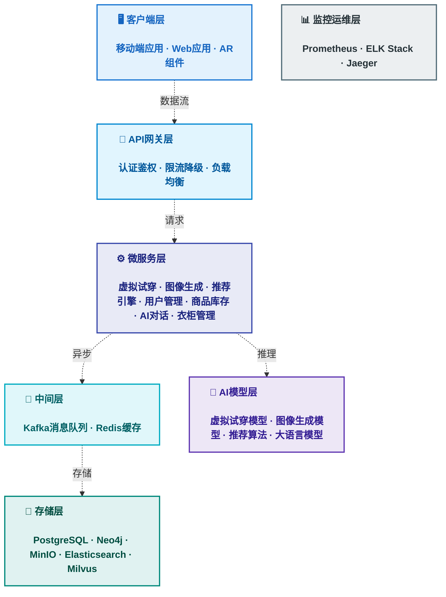

# Innovation-kun 系统架构框架图

**项目名称**: 个人形象智能顾问助手  
**文档版本**: v1.0  
**编制日期**: 2026年1月22日

---

## 整体技术架构

> 💡 **提示**: 推荐在浏览器中打开 `系统架构图.html` 查看高清交互版本，效果更佳

---

### Mermaid版本



---

## 架构分层说明

### 1️⃣ 客户端层 (Client Layer)
**职责**: 用户交互界面，提供多端访问能力

| 组件 | 技术栈 | 核心功能 |
|------|--------|---------|
| iOS/Android App | React Native | 穿搭推荐、虚拟试穿、衣柜管理 |
| Web App | React + TypeScript | 浏览器端访问、管理后台 |
| AR组件 | MediaPipe | 实时姿态检测、AR试穿 |

---

### 2️⃣ API网关层 (Gateway Layer)
**职责**: 统一入口，流量控制，安全认证

| 组件 | 功能 |
|------|------|
| API Gateway | 路由转发、协议转换 |
| 认证鉴权 | OAuth 2.0、JWT Token |
| 限流熔断 | 防止服务过载、降级策略 |
| 负载均衡 | 请求分发、健康检查 |

---

### 3️⃣ 微服务层 (Microservices Layer)
**职责**: 核心业务逻辑，模块化服务

#### AI核心服务组
```
┌─────────────────────────────────────────┐
│ 虚拟试穿服务 (Virtual Try-On Service)  │
│ • 扩散模型推理                          │
│ • 图像预处理/后处理                     │
│ • 超分辨率增强                          │
│ • 异步任务队列管理                      │
└─────────────────────────────────────────┘

┌─────────────────────────────────────────┐
│ 图像生成服务 (Image Generation Service)│
│ • 文本到图像生成                        │
│ • 可控生成 (姿态、风格)                 │
│ • 提示词优化                            │
│ • 批量生成调度                          │
└─────────────────────────────────────────┘

┌─────────────────────────────────────────┐
│ 推荐引擎服务 (Recommendation Service)   │
│ • 多任务学习模型                        │
│ • 知识图谱推理                          │
│ • 实时个性化排序                        │
│ • 冷启动策略                            │
└─────────────────────────────────────────┘
```

#### 业务支撑服务组
```
┌─────────────────┬─────────────────┐
│ 用户管理服务    │ 商品库存服务    │
│ • 用户档案      │ • 电商API对接   │
│ • 体型数据      │ • 实时库存      │
│ • 偏好设置      │ • 价格监控      │
└─────────────────┴─────────────────┘

┌─────────────────┬─────────────────┐
│ AI对话服务      │ 衣柜管理服务    │
│ • LLM集成       │ • 衣物分类      │
│ • 多轮对话      │ • 搭配组合      │
│ • 意图识别      │ • 标签管理      │
└─────────────────┴─────────────────┘
```

---

### 4️⃣ 消息队列 & 缓存层 (Message & Cache Layer)
**职责**: 异步处理，性能优化

#### Kafka消息队列
```
主题设计:
• user-behavior-events    → 用户行为数据流
• tryon-task-queue        → 虚拟试穿任务
• recommendation-logs     → 推荐日志
• inventory-updates       → 库存变更通知
• image-generation-tasks  → 图像生成任务
```

#### Redis缓存
```
缓存策略:
• 推荐结果缓存 (TTL: 30分钟)
• 用户会话管理 (TTL: 24小时)
• 热点商品数据 (TTL: 10分钟)
• API响应缓存 (TTL: 5分钟)
• 排行榜数据 (实时更新)
```

---

### 5️⃣ 数据存储层 (Data Storage Layer)
**职责**: 数据持久化，多类型存储

| 存储类型 | 技术选型 | 存储内容 | 查询特点 |
|---------|---------|---------|---------|
| 关系数据库 | PostgreSQL | 用户、订单、交易 | ACID事务、复杂查询 |
| 图数据库 | Neo4j | 穿搭关系、知识图谱 | 关系推理、路径查询 |
| 对象存储 | MinIO/S3 | 图片、视频、模型 | 海量文件、CDN加速 |
| 搜索引擎 | Elasticsearch | 商品、日志、文本 | 全文检索、聚合分析 |
| 向量数据库 | Milvus | 图像特征、相似度 | 向量检索、ANN搜索 |

---

### 6️⃣ AI模型层 (AI Model Layer)
**职责**: AI能力支撑，模型推理

```
┌─────────────────────────────────────────────────┐
│                 AI模型矩阵                       │
├──────────────┬──────────────┬──────────────────┤
│ 虚拟试穿模型 │ 图像生成模型 │ 姿态估计模型     │
│ • 扩散模型   │ • 文生图     │ • 关键点检测     │
│ • GAN方案    │ • 可控生成   │ • 实时处理       │
│ • 体型适配   │ • 超分辨率   │ • 多人支持       │
├──────────────┼──────────────┼──────────────────┤
│ 推荐算法模型 │ 大语言模型   │ 审美评估模型     │
│ • 多任务学习 │ • 对话理解   │ • 风格识别       │
│ • CTR/CVR    │ • 意图识别   │ • 质量评分       │
│ • 协同过滤   │ • RAG检索    │ • 合规检测       │
└──────────────┴──────────────┴──────────────────┘
```

---

### 7️⃣ 监控运维层 (Monitoring Layer)
**职责**: 系统监控，故障排查

| 组件 | 功能 | 指标 |
|------|------|------|
| Prometheus | 指标采集 | QPS、延迟、错误率、资源使用 |
| ELK Stack | 日志聚合 | 错误日志、访问日志、业务日志 |
| Alertmanager | 告警通知 | 邮件、短信、钉钉、Slack |
| Jaeger | 链路追踪 | 请求路径、性能瓶颈、依赖分析 |

---

## 数据流转示意

### 虚拟试穿流程
```
用户上传照片 → API网关 → 虚拟试穿服务
                              ↓
                        写入Kafka任务队列
                              ↓
                        异步模型推理
                              ↓
                    结果存储MinIO + 缓存Redis
                              ↓
                        推送结果给用户
```

### 推荐流程
```
用户请求推荐 → API网关 → 推荐引擎服务
                              ↓
                    查询Redis缓存 (命中返回)
                              ↓
                    未命中 → 多任务模型推理
                              ↓
                    Neo4j知识图谱查询
                              ↓
                    Milvus向量检索
                              ↓
                    排序 + 缓存 + 返回
                              ↓
                    记录日志到Kafka → ES
```

### AI对话流程
```
用户输入文本 → API网关 → AI对话服务
                              ↓
                        意图识别分类
                              ↓
                ┌───────────────────────┐
                │                       │
           穿搭咨询            尺码查询
                │                       │
         调用推荐服务        查询用户体型数据
                │                       │
         知识图谱检索        计算推荐尺码
                │                       │
                └───────────────────────┘
                              ↓
                        LLM生成回复
                              ↓
                    多模态输出 (文字+图片)
```

---

## 技术架构特点

### ✅ 高可用设计
- **多副本部署**: 所有服务≥2个实例
- **故障自动转移**: Kubernetes健康检查 + 自动重启
- **数据多副本**: Redis集群、PostgreSQL主从、MinIO分布式
- **限流降级**: API网关限流 + 服务熔断

### ✅ 高性能优化
- **多级缓存**: 浏览器缓存 → CDN → Redis → 应用缓存
- **异步处理**: Kafka消息队列解耦 + 非阻塞IO
- **批量处理**: GPU批处理、数据库批量写入
- **连接池**: 数据库连接池、HTTP连接池

### ✅ 可扩展性
- **水平扩展**: 微服务独立扩容
- **弹性伸缩**: 基于负载自动扩缩容
- **模块解耦**: 服务间通过API/消息队列通信
- **插件化**: 新模型/新功能可独立部署

### ✅ 安全合规
- **数据加密**: TLS 1.3传输 + AES-256存储
- **访问控制**: OAuth 2.0 + RBAC权限
- **隐私保护**: 数据脱敏 + 差分隐私
- **审计日志**: 全链路操作可追溯

---

## 部署架构图

```
┌─────────────────────────────────────────────────────────┐
│                    用户流量 (CDN)                        │
└─────────────────────────────────────────────────────────┘
                           ↓
┌─────────────────────────────────────────────────────────┐
│                  负载均衡 (Load Balancer)                │
└─────────────────────────────────────────────────────────┘
                           ↓
        ┌──────────────────┴──────────────────┐
        ↓                                      ↓
┌──────────────────┐              ┌──────────────────┐
│  Kubernetes集群  │              │  Kubernetes集群  │
│   (主区域)       │              │   (备份区域)     │
├──────────────────┤              ├──────────────────┤
│ • API网关 Pod    │              │ • API网关 Pod    │
│ • 微服务 Pods    │              │ • 微服务 Pods    │
│ • GPU节点 (4台)  │              │ • GPU节点 (2台)  │
│ • CPU节点 (8台)  │              │ • CPU节点 (4台)  │
└──────────────────┘              └──────────────────┘
        ↓                                      ↓
┌──────────────────────────────────────────────────────┐
│              Redis集群 (3主3从)                       │
└──────────────────────────────────────────────────────┘
        ↓
┌──────────────────────────────────────────────────────┐
│           Kafka集群 (3 Brokers + 3 ZK)               │
└──────────────────────────────────────────────────────┘
        ↓
┌─────────────┬─────────────┬─────────────┬───────────┐
│ PostgreSQL  │   Neo4j     │   MinIO     │    ES     │
│  (主从)     │  (单机)     │ (分布式)    │ (3节点)   │
└─────────────┴─────────────┴─────────────┴───────────┘
```

---

## 关键技术指标

| 指标类型 | 目标值 | 备注 |
|---------|--------|------|
| **性能指标** |
| 推荐接口响应 | P99 < 500ms | 含缓存命中 |
| 试穿生成时间 | P95 < 15秒 | GPU推理+超分 |
| 并发用户数 | 5000+ | 峰值支撑 |
| 日处理试穿量 | 8000+ | 4×GPU节点 |
| **可用性指标** |
| 系统可用性 | 99.9% | 年停机<8.76小时 |
| RTO恢复时间 | < 5分钟 | 故障自动切换 |
| RPO数据丢失 | < 1小时 | 多副本+备份 |
| **容量指标** |
| DAU支持 | 10-20万 | 初期目标 |
| 图片存储 | 10TB+ | 可扩展 |
| 模型权重 | 500GB | GPU节点本地 |

---

**编制**: Innovation-kun技术团队  
**审核**: 待审核  
**版本历史**: 
- v1.0 (2026-01-22): 初始版本
